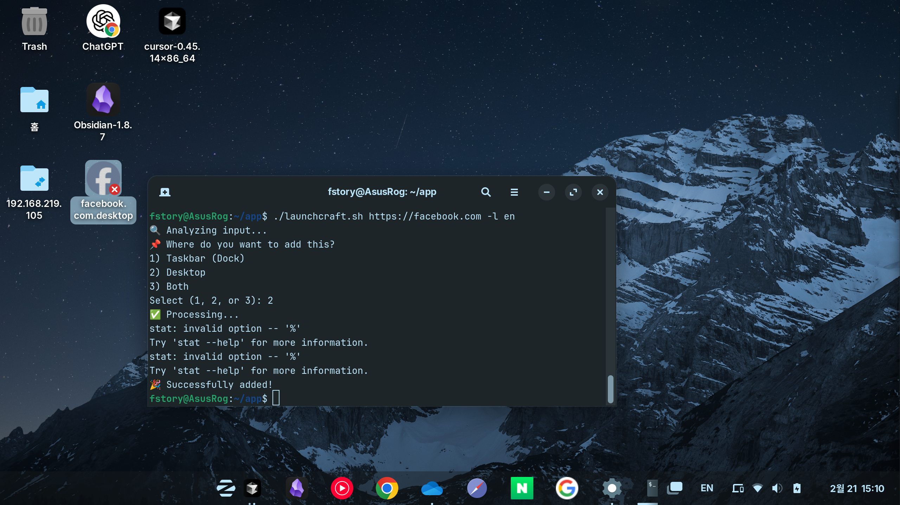

# LaunchCraft

LaunchCraft는 리눅스 데스크톱 환경에서 AppImage 파일과 웹사이트 바로가기를 위한 애플리케이션 아이콘(AppIcon)을 관리하는 유틸리티 도구입니다.

## 주요 기능

- AppImage 애플리케이션을 위한 데스크톱 엔트리(.desktop 파일) 생성
- 커스텀 아이콘이 포함된 웹사이트 바로가기 생성
- 간단한 쉘 스크립트 기반 솔루션
- 다국어 지원 (영어/한국어)

## 사용 방법

1. 스크립트 실행 권한 부여:
```bash
chmod +x launchcraft.sh
```

2. AppImage 파일이나 URL과 함께 스크립트 실행:
```bash
# AppImage 파일 등록
./launchcraft.sh /path/to/your/application.AppImage

# 웹사이트 바로가기 생성
./launchcraft.sh https://example.com

# 한국어로 실행
./launchcraft.sh -l ko /path/to/your/application.AppImage
```

3. 대화형 프롬프트를 통해 다음 설정:
   - 설치 위치 선택 (작업 표시줄/바탕화면/모두)
   - AppImage의 경우: 앱이 실행되면 십자 모양(+) 커서로 해당 앱 창을 클릭하여 창 클래스 설정

## 참고사항

- 창 감지: 정상적인 통합을 위해 애플리케이션 창 클래스를 감지해야 합니다. 안내 메시지가 나타나면 십자 커서로 애플리케이션 창을 클릭해주세요.
- 언어: 시스템 로케일이 한국어인 경우 자동으로 한국어로 표시됩니다. -l 옵션으로 언어를 수동 지정할 수 있습니다.
- URL 바로가기 등록시 실행 권한 설정 : 바탕화면 등록 후, 마우스 오른쪽 버튼으로 아이콘 클릭 후, 속성 탭에서 실행 권한 설정

## 사용 예시


### AppImage 애플리케이션 추가

* GPU오류가 발생하지만 정상적으로 동작합니다. 무시해도 됩니다.

### URL 바로가기 추가

* 마우스 오른쪽 키를 눌러 '실행 허용' 을 허가해줍니다.


## 시스템 요구사항

- 리눅스 배포판:
  - 데비안 기반 배포판 (Debian, Ubuntu 등)
  - Zorin OS 17 (Core)에서 테스트됨
- 데스크톱 환경:
  - GNOME 데스크톱 환경
  - GTK 기반 환경
- 필요한 패키지:
  - bash
  - wget 또는 curl
  - gtk-update-icon-cache
  - update-desktop-database

## 테스트 환경

### 운영체제
- ✅ Zorin OS 17 (Core)
- 👍 다음 환경에서도 작동 예상:
  - Ubuntu (20.04 LTS 이상)
  - GNOME을 사용하는 기타 데비안 기반 배포판

### 애플리케이션
- AppImage:
  - Obsidian
  - Cursor IDE
- 웹사이트:
  - ChatGPT (chat.openai.com)
  - Google (google.com)
  - Naver (naver.com)

## 라이선스

이 프로젝트는 MIT 라이선스를 따릅니다 - 자세한 내용은 [LICENSE](LICENSE) 파일을 참조하세요.

## 기여하기

프로젝트 기여를 환영합니다! Pull Request를 자유롭게 제출해 주세요.
