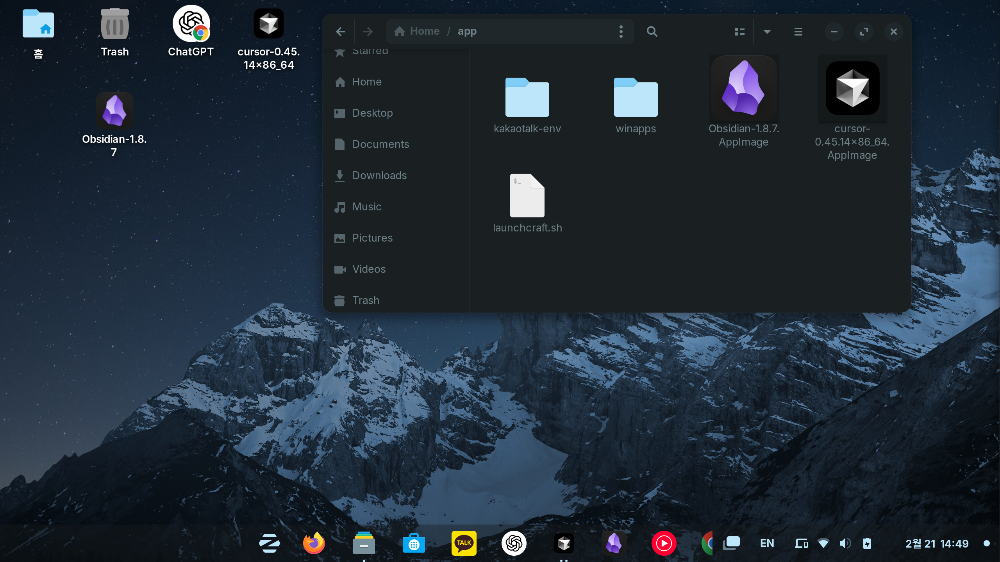
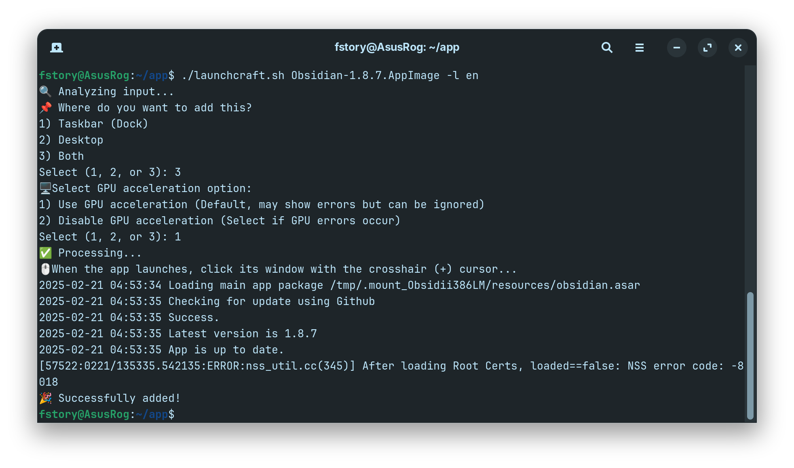
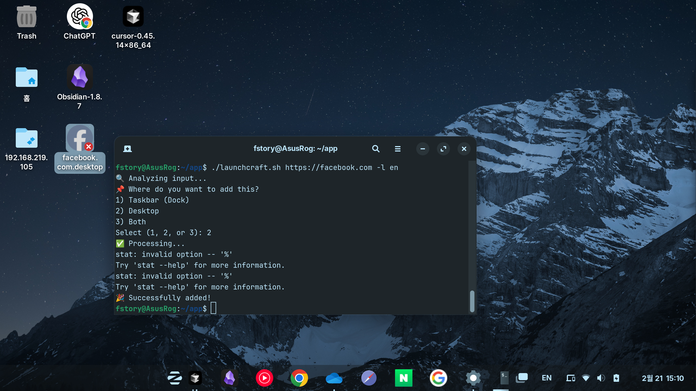

# LaunchCraft

LaunchCraft is a utility tool for Linux desktop environments that helps manage application icons (AppIcon) for AppImage files and website shortcuts.

## Features

- Create desktop entries (.desktop files) for AppImage applications
- Generate website shortcuts with custom icons
- Simple shell script based solution
- Multi-language support (English/Korean)

## Usage

1. Make the script executable:
```bash
chmod +x launchcraft.sh
```

2. Run the script with AppImage file or URL:
```bash
# For AppImage
./launchcraft.sh /path/to/your/application.AppImage

# For website shortcut
./launchcraft.sh https://example.com

# With Korean language option
./launchcraft.sh -l ko /path/to/your/application.AppImage
```

3. Follow the interactive prompts to:
   - Choose installation location (Dock/Desktop/Both)
   - For AppImage: When the app launches, click its window with the crosshair (+) cursor to set the correct window class

## Notes

- Window Detection: The script needs to detect the application window class for proper integration. When prompted, click the application window with the crosshair cursor.
- Language: The script automatically uses Korean if your system locale is Korean, English otherwise. You can override this with the -l option.
- Permission: When registering a URL shortcut, set the execution permission by right-clicking on the desktop icon and selecting "Properties".

## Examples

### Adding an AppImage application

* GPU-related errors may appear but can be safely ignored. The application will work correctly.

These screenshots show:
1. Some GPU-related errors may appear but the application works correctly
2. The crosshair cursor will appear to detect the application window

### Adding a website shortcut

* Right-click and enable 'Allow executing file as program' to grant execution permission.

## System Requirements

- Linux distributions:
  - Debian-based distributions (Debian, Ubuntu, etc.)
  - Tested on Zorin OS 17 (Core)
- Desktop environments:
  - GNOME Desktop Environment
  - GTK-based environments
- Required packages:
  - bash
  - wget or curl
  - gtk-update-icon-cache
  - update-desktop-database
  - xprop

## Tested Environments

### Operating Systems
- ✅ Zorin OS 17 (Core)
- 👍 Should work on:
  - Ubuntu (20.04 LTS or newer)
  - Other Debian-based distributions with GNOME

### Applications
- AppImage:
  - Obsidian
  - Cursor IDE
- Websites:
  - ChatGPT (chat.openai.com)
  - Google (google.com)
  - Naver (naver.com)

## License

This project is licensed under the MIT License - see the [LICENSE](LICENSE) file for details.

## Contributing

Contributions are welcome! Please feel free to submit a Pull Request.

## Upcoming Features

- GUI interface with drag-and-drop support
- File dialog for easier file selection
- Enhanced icon management capabilities

## Troubleshooting

### Icon Not Showing
- Ensure the application is installed correctly and the icon is set in the application properties.

### Execution Permission Issue
- Right-click on the shortcut and select "Properties". Go to the "Permissions" tab and ensure the "Allow executing file as program" option is checked.

### Website Shortcut Not Working
- Ensure the URL is correct and accessible. If the website requires authentication, make sure to log in before trying to access the shortcut.
